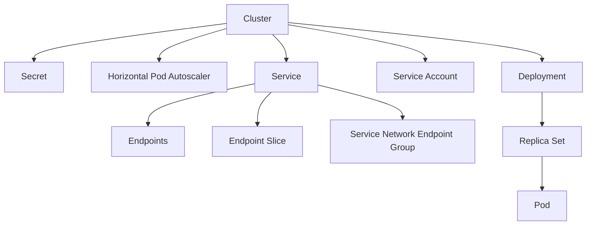

## Book

### 核心

- 預先準備
- 編寫文件
- 減少人工介入
- 追求 simplicity

1. embrace risk
2. service level objectives ??
3. eliminate toil
4. monitor
5. automation
6. release engineering
7. simplicity

### Embrace risk

#### Error Budget

- 100% reliability 不現實
  - 用戶裝置都無法 100%
- 根據服務需求決定 availability
  - 99.99% `availability` == 0.01% `unavailability` == 0.01% `error budget`
    - 也可以設定其他數字
- 偵測 unplanned downtime 或 unsuccessful request
- 盡情更新, 直到用完 error budget

### Monitor

- 警報應該分析問題嚴重程度
  - alert
    - 需要`立刻`有人工介入
  - ticket
    - 需要有人工介入
  - logging

### Postmortem

1. 發生什麼事情
2. 原因
3. 下次怎麼避免 / 處理

### Update

1. progressive rollout
2. 快速發現問題
3. rollback

### 雜項

- 人工操作的時間上限 50%. 剩下時間拿去開發取代人工的程式
  - 讓開發人員分擔部份工作

## Certificate

- Crt.sh 查詢 certificate
  - 注意不要用到 precertificate
    - 是 ca 產生 certificate 的中間產物
- certificate chain
  - https://www.ietf.org/rfc/rfc2246.txt
  - certificate list is a sequence (chain) of X.509v3 certificates
  - the sender's certificate must come first in the list
  - each following certificate must directly certify the one preceding it
  - root certificate authority may optionally be omitted from the chain
- The certificate signature is verified using the public key in the issuer's certificate
  - https://www.ibm.com/docs/en/ztpf/1.1.0.15?topic=ca-certificate-chain-verification

### 指令

- `openssl x509 -in ${.crt 檔案} -noout -text` 查詢細節
  - `Issuer`: 發行單位名稱
  - `Authority Information Access`
    - `CA Issuers`: 發行單位 CA 位置。如果找不到且不是 root CA 可能是古早 CA
    - `OCSP` 檢查撤銷
- `curl -o intermediate.crt ${Authority Information Access}` 下載 issuer 的 crt
  - `curl -o intermediate.crt $(openssl x509 -in $憑證路徑 -noout -text | grep "CA Issuers - URI" | sed 's/.*URI://')`
- `openssl x509 -inform DER -in intermediate.crt -out intermediate.crt` 轉換 crt 格式
- `openssl x509 -in crt-intermediate.crt -noout -subject -issuer | sed 's/.*CN=//' | uniq -c` 只有一行輸出就是 root CA
- `openssl verify -untrusted ${intermediate crt} -untrusted ${其他中間憑證, 順序沒差} ${leaf crt}` 實驗驗證

## Database

- Point in time recovery (以 MongoDB 為例)
  1. 用最新的備份建立 DB
  2. 載入要被替換的 DB 的 oplog
     - 到出問題的時間點之前
  3. 替換 DB

### Redis

#### 設定

- /etc/redis/redis.conf
- /etc/redis/sentinel.conf
- 範例: https://redis.io/docs/latest/operate/oss_and_stack/management/config-file
- 在 cli 打 `INFO`, `CONFIG GET *`
  - 自動抓 master 的 info: `redis-cli -h $(redis-cli -p 26379 SENTINEL get-master-addr-by-name mymaster | head -1) info`
- 在 shell 打 `redis-cli -p 26379 info sentinel`
- 在 shell 打 `redis-cli info replication`
- 存目前的設定到 redis.conf
  - `redis-cli config rewrite`
  - https://redis.io/docs/latest/commands/config-rewrite/
- diskless rdb transfer 有 master 端跟 slave 端設定
  - 如果 slave 端沒開啟 diskless，會在載入新資料之前 flush

#### Debug

- redis 使用 jemalloc，所以不會即時還 memory 給 os
- /var/log/redis/server.log
- `INFO MEMORY` 檢查記憶體碎片化
- `MEMORY STATS` 檢查記憶體碎片化；dict resize 情況
- `CLIENT LIST` 檢查 replication buffer 用量

#### node 異動

- 更新 nodes 後, `redis-cli -h {each node} -p 26379 sentinel reset {master regex}`
  - clear state (failover in progress, replicas, sentinels)
- `redis-cli -h {any node} -p 26379 sentinel failover {master name}`
  - master name is usually mymaster
- failover (primary switch) 可能 rollback ??

##### Cluster

- https://redis.io/docs/latest/commands/cluster-failover/
  - 主動 failover 沒有 data loss, 有 downtime, 可能失敗
- https://redis.io/docs/latest/operate/oss_and_stack/reference/cluster-spec/
  - Write safety: 如果 write 沒有備份到 replica, 且 master 死亡, 會有 data loss  
    或者 write 太慢才到而 master 已經變成 replica
  - Availability: 如果有一組 master + replica 失聯, 就會無法繼續服務
- > Nodes use a gossip protocol to propagate information about the cluster in order to discover new nodes, to send ping packets to make sure all the other nodes are working properly, and to send cluster messages needed to signal specific conditions [ref](https://redis.io/docs/latest/operate/oss_and_stack/reference/cluster-spec/)
  - 新增 node 時: `CLUSTER MEET ip port`

##### Sentinel

- https://redis.io/docs/latest/commands/failover/
  - 主動 failover 沒有 data loss, 有 downtime, 可能失敗
- replication sync 失敗:
  - master buffer 不夠: https://blog.csdn.net/my_tiantian/article/details/89402507
    - 取消限制: `redis-cli -h {master} config set client-output-buffer-limit "slave 0 0 0"`
    - 還原: `redis-cli -h {master} config set client-output-buffer-limit "slave 256mb 64mb 60"`
  - 看 bgsave 跟 bgrewriteaof 用量
    - bgsave
      - dump.rdb 或 appendonly.aof.{pid}.base.rdb ??
      - 看 rdb cow ??
    - bgrewriteaof
      - appendonly.aof.{pid}.incr.aof ??
      - 看 aof cow ??

#### Performance

- https://blog.palark.com/failure-with-redis-operator-and-redis-data-analysis-tools/
  - LATENCY doctor
    - If you have very large objects that are often deleted, expired, or evicted, try to fragment those objects into multiple smaller objects
    - https://mp.weixin.qq.com/s?__biz=Mzg2NTEyNzE0OA==&mid=2247483677&idx=1&sn=5c320b46f0e06ce9369a29909d62b401
    - `redis-cli --bigkeys`
    - 過期相關設定 `lazyfree- lazy-expire yes`
    - 刪除的指令 `unlink` 取代 `del`
  - Redis-memory-analyzer
- 判斷 cpu 是否不夠用 `redis-cli -h $(redis-cli -p 26379 SENTINEL get-master-addr-by-name mymaster | head -1) --latency` 不要超過 1~5ms ??

#### Persistence

- RDB: snapshot
- AOF: 操作紀錄
  - Append Only File
  - fsync 保存紀錄到 disk
  - 圖像化 https://github.com/xueqiu/rdr?tab=readme-ov-file
  - 二合一: aof-use-rdb-preamble
    - 可以抑制 AOF 大小
    - 跟 RDB 無關. 可以關掉 RDB. https://github.com/redis/redis/issues/11520
- 可能發生的錯誤
  - AOF fsync is taking too long
  - AOF rewrite
  - https://redis.io/docs/management/optimization/latency/
  - https://redis.io/docs/latest/operate/oss_and_stack/management/persistence/#backing-up-aof-persistence
- https://redis.io/docs/management/persistence/
- 依靠 RDB 復原 Redis: https://stackoverflow.com/questions/14497234/how-to-recover-redis-data-from-snapshotrdb-file-copied-from-another-machine

#### 各種語言 client

- [C# StackExchange](https://github.com/StackExchange) 不使用 connection pool, 而是使用 ConnectionMultiplexer
  - 每個 multiplexer 似乎只有一條 connection

#### 雜項

- redis-cli -n={db number} {command} | xargs redis-cli -n={db number} {command}
  - 使用 sentinel 時, port 要是 26379
    - command line 還是可以用 6379
- TTL 會依據系統時間判定
  - 設定幾秒後過期 => 計算實際過期時間 => 檢查時依據系統時間判斷
  - 想要避免 redis 清掉還原的舊資料, 可以調整系統時間
    - 調整 linux 時間: https://askubuntu.com/questions/683067/how-to-stop-automatic-time-update-via-terminal
- redis info 欄位部分說明: https://github.com/redis/redis/issues/2375
  - redis-cli info replication 的 `master_repl_offset` - `slave_repl_offset` 代表 slave 資料的 lag 程度

### SQL

#### PostgreSQL

- database can be connected by all users by default
  - need to be revoked after creating new db
- `CREATEDB, CREATEROLE and cloudsqlsuperuser` are granted to new users
  - need to be revoked after creating new users

## [DNS](https://www.cloudflare.com/learning/dns/what-is-dns/)

- Trailing Dots tell the DNS server that this is a Fully Qualified Domain Name (FQDN).
  - 例如 `example.com.`
  - 設定 resource record 時需要特別標明為 FQDN, 以免被加上不預期的 root domain
- 註冊
  - Google DNS 之類的不會幫忙註冊, 需要另外處理（例如找 [Gandi](https://docs.gandi.net/zh-hant/domain_names/register/new_gtld.html), [Google](https://cloud.google.com/dns/docs/update-name-servers)）
- 四種 server
  - DNS recursor (recursive resolver)
    - 幫忙查詢的 server
    - 例如 Cloudflare 1.1.1.1, Google 8.8.8.4, 8.8.8.8
  - root nameserver
  - top level domain server
  - authoritative nameserver
- Recursive Query & Iterative Query
  - machine 透過 recursive query 詢問 recursor
  - recursor 用 iterative query 查詢 root, top level domain, authoritative nameserver
- 
- cache
  - browser / application
  - operating system
  - recursor
    - A record: 直接回 ip
    - NS record: 直接從紀錄的 NS record 開始詢問
    - top level domain server
    - root server: 通常是 cache 清空才需要查詢

### [Resource Record](https://www.cloudflare.com/learning/dns/dns-records/)

- 每個代表網域名稱的檔案叫做 `zone file`
- zone file 裡面有多筆 `resource record`
- `@` 代表 current domain
  - https://serverfault.com/questions/426326/what-is-the-name-for-a-dns-record-starting-with
- TTL 代表可以 cache 多久

#### SOA

- start of authority
- 每個 zone 都需要 & 只能有一個
- 描述該 zone
- 同步 primary & secondary 稱為 zone transfer
  - 先傳 SOA, 用 serial 判斷要不要更新
  - 透過 tcp

| 欄位    | 意義                                                                                                                    |
| ------- | ----------------------------------------------------------------------------------------------------------------------- |
| MNAME   | primary nameserver for the zone                                                                                         |
| RNAME   | email <br> 例如 admin.example.com 代表 admin@example.com <br> 不用 `@` 大概是因為 `@` 在 resource record 裡面有特殊含意 |
| SERIAL  | 版號 <br> secondary server 用來判斷要不要更新                                                                           |
| REFRESH | secondary server 的 polling 間隔                                                                                        |
| RETRY   | 如果 primary 失聯, polling 間隔                                                                                         |
| EXPIRE  | 如果 primary 失聯, secondary 還可以運作多久                                                                             |
| TTL     |                                                                                                                         |

#### NS

- nameserver
- 指向 domain name
- 不能指向 CNAME
- 表明在哪個 nameserver 可以查到目標 domain name

#### A

- address
- domain name 轉 ipv4

#### AAAA

- domain name 轉 ipv6

#### [PTR](https://www.cloudflare.com/learning/dns/dns-records/dns-ptr-record/)

- pointer
- ip 轉 domain name
- ip 以相反的方式紀錄
  - ipv4 結尾要 `.in-addr.arpa`
    - `192.0.2.255` => `255.2.0.192.in-addr.arpa`
  - ipv6 結尾要 `.ip6.arpa`
- 用途
  - email anti-spam filter
  - logging

#### [SRV](https://www.cloudflare.com/learning/dns/dns-records/dns-srv-record/)

- service
- domain name + port
- 不能指向 CNAME
- priority `越低`優先度越高
  - 同 priority 時, weight `越高`, 優先度越高

#### CNAME

- canonical name
- domain name 轉 domain name
- 幫主機設定別名
- 例如 sub domain name 共用 root domain name 的 ip
  - sub domain name 用 CNAME 指向 root domain name
  - 主機收到 request 再根據 url 判斷要給哪個網頁
- 避免 CNAME 指向另外一個 CNAME (浪費效能)

#### MX

- mail exchange
- 指向 domain name
- 不能指向 CNAME
- 導向處理信件的伺服器
- Simple Mail Transfer Protocol
- priority 越低優先度越高

#### [TXT](https://www.cloudflare.com/learning/dns/dns-records/dns-txt-record/)

- text
- 讓管理者備註
  - 還能用來處理垃圾信件
    - 用來實作 Domain Keys Identified Mail (DKIM)
      - 簽名
    - Sender Policy Framework (SPF)
      - 標示用哪些 server 送信
    - Domain-based Message Authentication, Reporting & Conformance (DMARC)
  - 還能用來驗證 domain ownership

## Amazon

- awscli 登入: `aws configure sso`
  - `aws sso login --sso-session {設定的 SSO session name}`
  - `export AWS_PROFILE={profile 名稱}`
  - 確認有哪些 profile `cat ~/.aws/config`
- 所有資源上面都可以加上 tag
  - value 可以為空
  - display name 可能直接用 Name 這個 tag
  - 可用來管理權限
- cloud trail 記錄操作
- resource explorer 查詢有用到哪些資源
  - 昂貴版 cloud config ??
- cloud formation 類似 terraform
  - terraform 的 awscc 是包裝 cloud formation, 用於 aws 沒有支援的時候
- arn 是資源的 aws id
- trusted advisor, compute optimizer 協助 ??
- commitment 盡量用 compute saving plan
  - reserved instance 只用來搶資源 ??

### 權限

- organization unit (OU) 類似 user group ??
- service control policy: 套用全組織
- sso, scim: 跨服務驗證身份 (給人用的 ??)
  - 如果不用 sso, 而是另外設定 user 密碼, 且密碼外洩, 帳號會被鎖住
- identity federation: 跨服務驗證身份 (給服務用的)
- bedrock 權限
  - 文件: https://docs.aws.amazon.com/bedrock/latest/userguide/model-access-permissions.html
  - [create policy](https://us-east-1.console.aws.amazon.com/iam/home?region=ap-northeast-1#/policies/create)
    - 給予 Marketplace 的 ViewSubscriptions, Subscribe, Unsubscribe
    - 給予 Bedrock 的 ListFoundationModels, GetFoundationModelAvailability
  - [create user group](https://us-east-1.console.aws.amazon.com/iam/home?region=ap-northeast-1#/groups/create)
    - attach policy
  - [create user](https://us-east-1.console.aws.amazon.com/iam/home?region=ap-northeast-1#/users/create)
    - Security credentials -> Enable console access

## Google

- 比較 gce, gke, cloud run, cloud function
  - https://cloud.google.com/blog/topics/developers-practitioners/where-should-i-run-my-stuff-choosing-google-cloud-compute-option
  - https://cloud.google.com/products/calculator?hl=en

### App Engine

- 可以放 web application, 靜態網頁
- deployer 權限需求: Service Account User, Cloud Build Editor, App Engine Admin, Storage Admin
- app.yaml
  - service 代表名稱. 預設值是 default
    - service defines to which service this app will be deployed. If the service is not defined, the app will be deployed always to the default service
  - https://cloud.google.com/appengine/docs/standard/reference/app-yaml
- 跟 bucket 比起來, 優點是能加上 [Identity Aware Proxy](#Identity-Aware-Proxy)
  - [standard](https://cloud.google.com/appengine/docs/standard/serving-static-files?tab=node.js)
    - The content in the static files or static directories are unaffected by the scaling settings in your app.yaml file. Requests to static files or static directories are handled by the App Engine infrastructure directly, and do not reach the language runtime of the application.
  - [flexible](https://cloud.google.com/appengine/docs/flexible/serving-static-files?tab=node.js)
    - 似乎會用到 language runtime
- 如何部署 static website
  - https://cloud.google.com/appengine/docs/standard/hosting-a-static-website
- tf
  - `google_compute_region_network_endpoint_group` 指定 app engine service
  - `google_compute_backend_service` 接 `google_compute_region_network_endpoint_group`

### Big Query

- Cloud Bigtable, Cloud Storage, Google Drive, Cloud SQL, ...

#### 搜尋

- limit 不影響收費
  - 用多個 cpu 搜尋資料庫
  - 查詢所有資料之後才處理 limit
- 選擇 column
- partition table
- https://cloud.google.com/blog/products/data-analytics/cost-optimization-best-practices-for-bigquery

### Cloud CDN

- [不同種類的 Google CDN](https://cloud.google.com/cdn/docs/choose-cdn-product)
- [Cache Mode](https://cloud.google.com/cdn/docs/caching)
  - `CACHE_ALL_STATIC` (default): 沒有 cache control header, content type header 符合[條件](https://cloud.google.com/cdn/docs/caching#static)
  - `USE_ORIGIN_HEADERS`: [Cache control](https://cloud.google.com/cdn/docs/caching#cache_control_directives)
  - `FORCE_CACHE_ALL`: 覆蓋原本的 cache 設定
    - 不同的 vary header 不會共用 cache entry
- [可以客製化 cache key](https://cloud.google.com/cdn/docs/caching#cache-keys)
  - 多個 schemes, hosts 拿到同樣的結果
    - [Cache 跨 project 共用](https://cloud.google.com/cdn/docs/overview#eviction)
      - 同地區
  - 不同 query string, header, cookie 拿到不同的結果
  - 如果 request 缺 cache key, 可以當作該 cache key 為空值
- Negative caching: 根據 response code, cache 一段時間
- [Serve stale content](https://cloud.google.com/cdn/docs/serving-stale-content)
  - 避免被故障影響, 減少延遲
  - 兩筆 log:
    - 給 user 的內容
    - async 最新資訊
  - client 可以用 max-stale header
- [Non-cacheable content based on origin headers](https://cloud.google.com/cdn/docs/caching#non-cacheable_content)
- [Bypass by header](https://cloud.google.com/cdn/docs/caching#bypassing-cache)
- [Invalidation](https://cloud.google.com/cdn/docs/cache-invalidation-overview)
  - 1 per min
- [支援 Byte-range requests: 一次只拿部份](https://cloud.google.com/cdn/docs/caching#byte-range-requests)
- CDN 支援 ETag, Last-Modified
  - 需要在 response 特別標示 ETag, Last-Modified
- [TTL](https://cloud.google.com/cdn/docs/using-ttl-overrides)

|             | FORCE_CACHE_ALL    | CACHE_ALL_STATIC   | 意義                                                     |
| ----------- | ------------------ | ------------------ | -------------------------------------------------------- |
| Default TTL | :heavy_check_mark: | :heavy_check_mark: | CDN 預設值                                               |
| Max TTL     |                    | :heavy_check_mark: | CDN 最大值 <br> FORCE_CACHE_ALL 會覆蓋, 所以只要 default |
| Client TTL  | :heavy_check_mark: | :heavy_check_mark: | client TTL                                               |

- [Log](https://cloud.google.com/cdn/docs/logging)
- response size 小於約 80kb 的話會開始變成掛 CDN 比較貴，因為有 per request 計算的 cache lookup 費用  
  小到 3kb 的話連 APAC hit rate 90% 都還是 CDN 比較貴

### Cloud function

- Firebase function is built on Cloud function

### Cloud Run

1. prepare files to build docker image
   1. create binary that will be executed in docker container
2. `gcloud auth configure-docker`
3. `docker build -t {registry}/{image_name}:{image_tag} .`
4. `docker push {registry}/{image_name}:{image_tag}`
5. `gcloud run deploy --allow-unauthenticated --image {registry}/{image_name}:{image_tag} --port {port}`
   - 如果沒有權限設定 `--allow-unauthenticated`, 可以請有權限的人在 web console 對應 service 的 `TRIGGERS`/`Authentication` 設定 `Allow unauthenticated invocations`
   - `gcloud run deploy --help` for more options
   - On success, the command line displays the service URL.
     - 也可以查詢 web console 對應 service 的 DETAILS
     - https://cloud.google.com/run/docs/quickstarts/build-and-deploy/deploy-go-service#deploy

- gcloud beta run deploy 可以關閉 default url: `--no-default-url`
- 可以設定 ingress: internal-and-cloud-load-balancing
  - 其他 Google 服務可以透過 cloud run default url 走 Google 內網
  - GKE subnet 需要設定 private_ip_google_access=true

---

- Health checks are not supported for serverless backends. Therefore, backend services that contain serverless NEG backends cannot be configured with health checks. However, you can optionally enable outlier detection to identify unhealthy serverless resources and route new requests to a healthy serverless resource.

### Cloud Storage

- https://github.com/raymond-chia/Note/blob/main/Troubleshooting.md#cloud-storage
- [每個 object 可以自行決定 storage class (standard, coldline, ...)](https://cloud.google.com/storage/docs/storage-classes#classes)
  - Autoclass 可以自動設定 storage class
- Built-in Cache vs Cloud CDN: https://cloud.google.com/storage/docs/caching#with
  - CDN cache size 其他資訊: https://cloud.google.com/cdn/docs/caching#maximum-size
- Object Lifecycle, Retention, Object Hold (類似 lock), Object Versioning, Compress (Transcoding)
  - Versioning 需要自行刪除過時的版本, 就算取消 versioning 也要手動刪除
- https://docs.cloud.google.com/storage/docs/request-endpoints#cookieauth
  - https://storage.cloud.google.com 會檢查是否登入
  - https://storage.googleapis.com 不會檢查是否登入
  - 無痕無法使用 https://storage.cloud.google.com @ 2025/11
- [XML API 不支援 Access-Control-Allow-Credentials](https://docs.cloud.google.com/storage/docs/cross-origin#additional-considerations)
  - 要用 JSON API 加上 access token
- [When alt=media is included as a query parameter in the request, this method retrieves object data](https://cloud.google.com/storage/docs/json_api/v1/objects/get)

### Compute Engine

- [Compute Engine default service account](https://cloud.google.com/compute/docs/access/service-accounts#default_service_account)
  - Attached by default to all VMs
- attach disk 需要 format & mount. Google 不會自動處理.
  - https://cloud.google.com/compute/docs/disks/add-persistent-disk
- `gcloud compute ssh` 連上 vm 跑 user background process
  - 登出前會停掉 background process, 然後才能登出
  - https://unix.stackexchange.com/questions/682793/why-background-process-terminated-after-ssh-session-closed/682794#682794
- 用網頁連上 vm 跑 user background process ( 使用 `&` )
  - 關閉網頁 `短時間內` 不會停掉 background process
  - 關機時才會停掉
- disk
  - [Increasing the size of a disk doesn't delete or modify disk data](https://cloud.google.com/compute/docs/disks/resize-persistent-disk)
  - resize disk 之後, 如何調整 file system. (file system 需要知道 disk 變化)
    - https://cloud.google.com/compute/docs/disks/resize-persistent-disk#resize_partitions
  - snapshot
    - rate limit: 1 hr 6 次
    - 可以不接到 vm
    - 不佔用 disk io, disk throughput ??
    - https://cloud.google.com/compute/docs/disks/snapshots
    - 只會紀錄跟上次 snapshot 有差異的部分 ??
    - import 時
      - `projects/{project name}/global/snapshots/{snapshot name}`
      - 同 project 可以只打 snapshot name

### Database

- 連線
  - `gcloud --project=${project} compute ssh ${目標機器} --zone=${zone} -- -NL ${localport}:localhost:${目標 port}`
  - `gcloud compute start-iap-tunnel ${target_instance.name} ${target_port} --project=${project_id} --zone=${target_instance.zone} --local-host-port=localhost:9999`

### Firebase

- Firestore
  - 就算 collection 名稱不同, security rules 依舊容易打架

### GKE

1. 按下 Deploy, 並按照表格填寫
2. 按下 expose, 填寫 dockerfile expose 的 port

- 用 crictl 而非 docker
- GKE 可以放在 managed instance groups
- https://cloud.google.com/kubernetes-engine/docs/concepts/cluster-autoscaler#balancing_across_zones
  - cluster autoscaler attempts to keep these managed instance group sizes balanced when `scaling up`
    - [也許要設定 topologySpreadConstraints ??](https://cloudhero.io/kubernetes-evenly-distribution-of-pods-across-cluster-nodes/)
    - scale down 的時候直接砍 underutilized nodes
      - 也就是 scale down 的時候, `group sizes` 可能`分佈不均`
        - `kubectl get pods -l {key}={value} -o json | jq -r '.items.[].status.conditions.[].message | select( . != null )'` ??
      - https://github.com/kubernetes-sigs/descheduler 也許有用 ??
- node 會隨機開在 region 裡面的任何 zone
- 網址用 [svc record](https://kubernetes.io/docs/concepts/services-networking/dns-pod-service/#a-aaaa-records) 才會走內網
  - `_port-name._port-protocol.my-svc.my-namespace.svc.cluster-domain.example`
    - `_port-name` 例如 http 或 grpc (For a regular Service 可省略)
    - `_port-protocol` 例如 tcp 或 udp (For a regular Service 可省略)
    - `my-svc`
    - `my-namespace`
    - `cluster-domain.example` 集群域名後綴. 通常是 cluster.local

#### Workload api object

- deployment
  - 掌管 ReplicaSets
  - rolling update
  - rollback
  - version control
- stateful set
  - 會依照固定順序更新
  - 特性
    - consistent & unique identiy
    - persistent storage
    - stable network identity
- daemon set
  - 1 pod per node
  - 可以用來
    - 收集 logs
    - monitor
    - manage network traffic across entire cluster

#### Workload Identity

- Cluster 開啟 Workload Identity
- 需要設定權限 roles/iam.workloadIdentityUser
- [spec.template.spec.serviceAccountName](https://cloud.google.com/run/docs/configuring/services/service-identity#yaml)
  - 值是 kustomize yaml 裡面的 service account `kind` 的名稱

#### Log

- 用 google console ui 的 workload 可以快速設定 log explorer
- `labels."compute.googleapis.com/resources_name"` 是 node name (VM name)
- `resource.lables.pod_name` 是 pod name

#### 雜項

- node pool 在 clusters 裏面
- fluentbit-gke 在 kube-system
- disk 效能 vs machine type
  - https://cloud.google.com/compute/docs/disks/performance

### Identity Aware Proxy (IAP)

- https://cloud.google.com/iap/docs/concepts-overview#how_iap_works
  - 在 app engine / load balancer 檢查 cookie 中的 jwt
  - 在 Google 內網呼叫不會經過 LB = 不會經過 IAP. 內網用 firewall
  - WebSocket 不會再檢查 iap
- 在 local 無 key 產生 id token
  - https://cloud.google.com/iap/docs/authentication-howto#curl
- 在 local 用 service account 產生 jwt
  - https://cloud.google.com/iap/docs/authentication-howto#signing_the_jwt
  - aud 是 `目標 url` 含 scheme (https://example.com)
- 只認 cookie 不管來自哪個網站 ??

#### 讓網頁用 ID token 通過 IAP

- [ ] 取得現有設定
  - `gcloud iap settings get --project <project id> --resource-type compute --service <backend service name> > iap.yaml`
- [ ] 編輯
  - 設定唯一一個 share oauth client 時可用 `yq -y -Y -i '.access_settings={oauth_settings:{programmatic_clients: ["<prompt graph oauth client>"]}}' iap.yaml`
  - ref. https://cloud.google.com/iap/docs/sharing-oauth-clients#programmatic_access
- [ ] 套用
  - `gcloud iap settings set --project <project id>--resource-type compute --service <backend service name> iap.yaml`
- [ ] 允許 preflight 通過 iap
  - [目前 terraform 不支援](https://github.com/hashicorp/terraform-provider-google/issues/6471)
  - 在網頁勾選正確的 backend services 的 Settings 的 HTTP Options 的 Enable HTTP Options

### Firewall

- firewall rule
  - 適用於 targets
  - 允許特定 source 呼叫 target

### Load Balancer

- Google 內部服務也用 Global Server Load Balancer 尋找 ip
- [Choose](https://cloud.google.com/load-balancing/docs/choosing-load-balancer)  
  

#### [External TCP/UDP Network Load Balancing](https://cloud.google.com/load-balancing/docs/network/networklb-backend-service)

- 不影響 source & destination ip, protocol, port
- 不會關掉連線
  - 無法自行擋住惡意連線
- 不會處理 SSL
- architecture
  - backend service
    - ipv4 (standard, premium), ipv6 (premium)
    - auto scaling with managed instance groups
    - distribution control
      - health check
      - source ip based traffic steering
      - session affinity  
        [connection tracking](https://cloud.google.com/load-balancing/docs/network/networklb-backend-service#tracking-mode)
      - connection draining
        - in progress requests are given time to complete when a VM is removed or when an endpoint is removed
      - failover policy
    - component
      - 1 regional external backend service (決定 balancer 怎麼導流量到 backend instance groups)
      - multiple regional external ip addresses  
        [multiple regional external forwarding rules](https://cloud.google.com/load-balancing/docs/network/networklb-backend-service#forwarding-rule-protocols)
        - protocol, ip address, port based
      - multiple backend instance groups
    - must create firewall rules that allow your load balancing traffic and health check probes to reach the backend VMs
  - target pool
    - legacy
- 

#### [External HTTP(S) Load Balancing](https://cloud.google.com/load-balancing/docs/https)

- header
  - 保存 Host header
  - X-Forwarded-For
    - `X-Forwarded-For: ...,{client-ip},{load-balancer-ip}`
    - https://cloud.google.com/load-balancing/docs/https#x-forwarded-for_header
      - Thus, an upstream process after your load balancer's backend might receive an X-Forwarded-For header of the form:
        `<existing-values>,<client-ip>,<load-balancer-ip>,<GFE-IP>,<backend-IP>`
- Global external HTTP(S) load balancer
  - PREMIUM
  - Health check
  - Firewall rules
  - forwarding rule, target proxy, url map, backend service 的關係: https://cloud.google.com/static/load-balancing/images/internal-https-forwarding-rule.svg
  - An external forwarding rule
  - A target HTTP(S) proxy
    - Support SSL certificates
      - 藏在 [load balancing components view](https://console.cloud.google.com/net-services/loadbalancing/advanced/sslCertificates/list)
    - 可能會改 header 大小寫
    - URL map
      - Request path, cookies, headers
  - Support cloud trace
  - Support custom headers (似乎不能搭配 Cloud CDN)
- Regional external HTTP(S) load balancer
  - STANDARD
  - A proxy-only subnet is used to send connections from the load balancer to the backends. [ref](https://cloud.google.com/load-balancing/docs/https#proxy-only-subnet)
    - 
    - Backend VMs or endpoints of all regional external HTTP(S) load balancers in a region and VPC network receive connections from the proxy-only subnet.
      - 應該是指所有 VM 只會看到 proxy-only subnet 來的 load balancer connection
  - Health check
  - Firewall rules
    - 1 for health check
    - 1 for proxy-only subnet
  - A target HTTP(S) proxy
  - 如果要用 cloud trace 或 custom headers, 可以用 standard tier 的 Global external HTTP(S) load balancer `(classic)`
    - 但是 url map 的功能比較少
- 

##### SSL Certificate

- 如果在 DNS 好之前就建立 SSL Certificate, Certificate 可能卡在 FAILED_NOT_VISIBLE

##### URL Map

- 一個 domain 指向一個 ip 指向一個 LB
- 一個 LB 可以有多個 domain
- 一個 LB 可以有多個 IP
  - 每個 ip 對應一個 google_compute_global_forwarding_rule
- 一個 LB 有一個 url map
- url map 可以送到 cdn, cdn 送到其他 LB ??
- url map 有 domain 時才會嘗試 health check
  - 如果暫時清空 domain. 下次填入 domain 時要等一段時間才會 health check
- url map 接 backend-service
  - backend-service 接 serverless-neg (app engine, cloud function)
  - backend-service 接 neg

##### Probe

- [不同 backend service 共用 probe 不會影響呼叫頻率](https://cloud.google.com/load-balancing/docs/health-check-concepts#multiple-probers)
  - 多個 backend service 接到同一個 backend 會導致 backend 被 health check 的頻率增加

#### Distribution

- 以 backend instance group 或 network endpoint group 為單位
  - NEG: 要在 kubernetes metadata annotation 設定  
    https://cloud.google.com/kubernetes-engine/docs/how-to/standalone-neg#create_a_service
    - Cluster 開啟 HTTP Load Balancing
    - NEG 建立時, 只有處理當下有 node 的 zone
      - 檢查 `gcloud compute network-endpoint-groups list`
    - schedule 到其他 zone 時, 會自動建立 NEG
    - terraform 建立 backend service 時, 需要包含 NEG 所有 region
    - 設定完 NEG 還要設定 load balancer
    - 修改 port 要重建 NEG
  - [GKE versions 1.18.18-gke.1200 可能會先建立所有 NEG ??](https://cloud.google.com/kubernetes-engine/docs/how-to/standalone-neg)
- [步驟](https://cloud.google.com/load-balancing/docs/https#request-distribution)
  1. Maglev
  2. 1st Google Front End
     - 2nd Google Front End 分配根據各個 region 的 load balancer 剩餘 capacity 比例
     - region load balancer 就不用選了
  3. 2nd Google Front End (知道 backend capacity usage)
  4. load balancer
     - balancing mode
  5. group
     - LocalityLbPolicy
- 三種 balancing mode
  1. connection
     - [表格](https://cloud.google.com/load-balancing/docs/backend-service#connection_balancing_mode)
     - concurrent connections the backend can handle
  2. rate
     - [表格](https://cloud.google.com/load-balancing/docs/backend-service#rate_balancing_mode)
     - 最大 RPS
  3. utilization
     - utilization of VMs
     - 會嘗試預估未來的 utilization
  - 無論哪種 balancing mode, 如果 backend 都滿了就會超過限制的值
- [各種 balancer 支援的 balancing mode 表](https://cloud.google.com/load-balancing/docs/backend-service#balancing-mode-combos)
- 如果用量太少, 會集中在一個 region
- 如果用量太多, 某些 group 會超過上限

#### 添加 Header

- custom header
- 可用來攜帶更多資訊, 例如 client 來自哪個國家
- 在 terraform 設定: https://registry.terraform.io/providers/hashicorp/google/latest/docs/resources/compute_backend_service#custom_request_headers-2
- 能用的列表: https://cloud.google.com/load-balancing/docs/https/custom-headers?_gl=1*1iture8*_ga*OTgxNDgyMjEzLjE3MzM3MjY2MDg.*_ga_WH2QY8WWF5*czE3NTU2NDkxNTEkbzE4MiRnMSR0MTc1NTY1MTY2MiRqMjUkbDAkaDA.

#### 修改

- 如果修改 LB 連到的後端, 需要小心原本的連線可能沒斷

### Metrics

- 可以設定掉資料的行為: https://cloud.google.com/monitoring/alerts/concepts-indepth#partial-metric-data
- cpu usage: 目前用量
- cpu utilization: 目前用量 / 所有核心總效能
- Google Managed Prometheus (GMP)
  - 可以自動在 metrics 加 label
  - https://console.cloud.google.com/monitoring/metrics-explorer 可以查看有哪些 prometheus metrics
- 文件
  - Legacy
    - agent.googleapis.com
    - https://cloud.google.com/monitoring/api/metrics_agent
  - GKE
    - https://cloud.google.com/monitoring/api/metrics_kubernetes
  - LB
    - https://cloud.google.com/monitoring/api/metrics_gcp
  - Redis
    - https://cloud.google.com/memorystore/docs/redis/supported-monitoring-metrics
  - SQL
    - https://cloud.google.com/sql/docs/mysql/admin-api/metrics
  - Logs Based Metrics
    - https://cloud.google.com/stackdriver/docs/solutions/slo-monitoring/sli-metrics/logs-based-metrics#lbm-defn
    - e.g. terraform 建立的 google_logging_metric
  - Custom
    - https://cloud.google.com/monitoring/custom-metrics

### 權限

- google_project_iam_binding 是 Authoritative for a given role.
  也就是同一個 role 只能有一個 binding, 不然會覆蓋
- Application Default Credentials (ADC) 尋找順序: https://cloud.google.com/docs/authentication/application-default-credentials
- 選擇驗證方式: https://cloud.google.com/docs/authentication#auth-decision-tree
- Workload Identity Federation
  - https://cloud.google.com/iam/docs/workload-identity-federation-with-deployment-pipelines

### Registry (Docker image registry)

- 實際存放在 Google cloud storage (至少 container registry 是. artifact registry 不確定)

### Signed URL

- 有存取限制 & 時間限制的 URL
- 例如: 臨時上傳 / 下載檔案

### Virtual Private Cloud

- > VPC peering however is way too broad, all ip’s across the both the VPC’s are visible to each other ??
  - > In this instance, since the intention is to selectively expose a service, a better mechanism is Private Service Connect
  - https://bijukunjummen.medium.com/connecting-gcp-vpc-networks-using-private-service-connect-4164be11c6a

### 故障

- hardware or software issue on the physical machine hosting your VM ??
  - https://cloud.google.com/compute/docs/instances/host-maintenance-overview
- 從 node name 找 ip
  - 有些 log 同時有 node name 跟 ip
    - `Successfully retrieved node IP`
    - `Detected node IP`
- CDN 判斷 ip 所在地區跟 cloud armor, load balancer 的可能不一致
  - 不同步可能持續數周
  - subdivision 為空的似乎有問題
  - 用 https://bgp.he.net 驗證 ip 的電信商
- 需要自行訂閱通知
  - https://console.cloud.google.com/user-preferences/communication
  - 否則可能漏掉某些升級, 棄用事件

### 費用相關

- 拆除時, 以下可以檢查 project 是否還有東西被用到
  - enabled apis & services
  - [asset inventory](https://console.cloud.google.com/iam-admin/asset-inventory/dashboard)
- 查詢用量
  - 到 billing/reports 設定 filter
  - `networking service` 只有 CDN
  - `compute engine service` 含有 egress, load balancer
    - 要查網路流量不能只看 networking
    - load balancer 收費有上限 ??
  - 網路流量
    - Network Intelligence
    - Metrics explorer > `compute.googleapis.com/instance/network/sent_bytes_count`
    - Logs Explorer
- 偵測 Quota 用量 https://cloud.google.com/monitoring/alerts/using-quota-metrics#mql-rate-multiple-limits
- 查詢費用 (透過 Big Query)
  - `usage_start_time` 是費用發生的時間
  - `view_PARTITIONTIME` 是費用寫進 bigquery 的時間

### 雜項

- cpu 效能表: https://cloud.google.com/compute/docs/coremark-scores-of-vm-instances?hl=zh-tw
- terraform 使用自訂 custom machine type 的範例 `n2-custom-68-552960`

## JQ

- https://hackmd.io/@il-suse/BJ_RoR8u_
- https://jqlang.github.io/jq/manual
  ```shell
  kubectl get pods -o json | jq '.items | first | keys[]'
  ```
  ```shell
  kubectl get pods -o json | jq '.items.[]'
  ```

## Kubernetes

- https://docs.google.com/presentation/d/10mm4ugzDvG93e4xEe8KsenIEnN9VnDFcpH19zo93Ghw/edit#slide=id.p
- https://kubernetes.io/docs/tutorials/

架構可以參考 Argo CD



### namespace

- 在一個 cluster 內分組 (group)
  - 避免不同 team, project 互相干擾
  - `resource quotas`: [限制各個 namespace 可用的資源](#限制資源)
    - 是用來管控 cpu, memory 這類資源
    - 盡量用 label 控管其他資源
- names of resources need to be unique within a namespace
- namespaced object vs cluster-wide object
  - `namespaced`: deployments, services, ...
    - 不能跨 namespace 共享
  - `cluster-wide`: storage class, nodes, persistent volumes, ...
- For a production cluster, consider not using the `default` namespace
  - [initial namespace](https://kubernetes.io/docs/concepts/overview/working-with-objects/namespaces/#initial-namespaces)
    - default
    - kube-node-lease
    - kube-public
    - kube-system: addons
      - DNS, web ui, container resource monitoring, cluster level logging
  - kube-xxx 未來可能被 kubernetes 使用

### 組成

- https://kubernetes.io/docs/concepts/overview/components/
- control plane
  - 管理 cluster
  - 有 etcd
    - consistent & highly available key value store
    - Kubernetes' backing store for all cluster data
  - 有 kube-apiserver 的部份可以 scale horizontally
    - 大概 control plane 其他部份都支援 horizontally scaling ??
  - 其他
- node
  - vm 或實體電腦
  - worker in cluster
  - 有 kubelet
    - agent for managing the node
    - communicating with control plane
    - 確保 pod specs 標示的 containers 都有在 pod 內
  - 有 container runtime
  - 有 kube-proxy 讓 pod 能連網
- pod
  - [可以被其他的 pod 或 cluster 內的其他服務看到](https://kubernetes.io/docs/tutorials/kubernetes-basics/deploy-app/deploy-interactive/)
  - 名稱是 `{replica set 名稱}-{亂碼後綴}`
  - STDOUT 會變成 container 的 log

### Objects

- https://kubernetes.io/docs/concepts/overview/working-with-objects/
  - apiVersion
    - Which version of the Kubernetes API you're using to create this object
  - kind
    - What kind of object you want to create
  - metadata
    - Data that helps uniquely identify the object, including a name string, UID, and optional namespace
  - spec
    - What state you desire for the object
    - https://kubernetes.io/docs/reference/kubernetes-api/
- Kind
  - Deployment
    - 簡介 https://kubernetes.io/docs/concepts/workloads/controllers/deployment
    - 可以設定的東西 https://kubernetes.io/docs/reference/kubernetes-api/workload-resources/deployment-v1/
  - [HorizontalPodAutoscaler](#kubectl)

#### kustomize

- [autocomplete kustomize](https://github.com/kubernetes-sigs/kustomize/blob/be8d60fb9f2fff23b2e2367c0acd393997fa9d47/cmd/config/internal/generateddocs/commands/docs.go#L41)
- port = pod port
- targetport = container port
- maxUnavailable
- secret 需要另外接到 container
  - [產生](https://kubernetes.io/docs/tasks/configmap-secret/managing-secret-using-kustomize)
  - 掛上 secret / configmap
    - [file 用 volumes + containers.volumeMounts](https://kubernetes.io/docs/concepts/configuration/secret)
    - env 用 envFrom

##### patches

- 方便設定不同環境
  - replace 之前先 `kubectl diff -Rf {directory}` ??
- 同一層不保證順序  
  要保證順序要分開, 用 resource 組合
  https://github.com/kubernetes-sigs/kustomize/issues/727
- inline patch
  - https://github.com/kubernetes-sigs/kustomize/blob/master/examples/inlinePatch.md
- patchesStrategicMerge 用法 (新版放棄了 https://github.com/metallb/metallb/issues/1985)
  - https://kubernetes.io/docs/tasks/manage-kubernetes-objects/kustomization/#customizing
- Deployment 的 spec.template.spec.containers 的 element 需要 name

#### Helm

- `helm get values {release-name}` 取得目前在用的設定
- `helm install redis-cluster ot-helm/redis-cluster -f values.yaml`

### Probe

- https://kubernetes.io/docs/concepts/workloads/pods/pod-lifecycle/#types-of-probe
- startupProbe: 是否該重啟, 是否啟動其他種類的 probe
- livenessProbe: 是否該重啟
- readinessProbe: 是否能服務
- 上述沒有設定時, 會檢查 the status of the container’s PID 1 process
  - https://kamsjec.medium.com/liveness-and-readiness-probes-91919f24e305

### kubectl

- apply 前都先 diff 看看, 避免不預期的狀況. 例如 image tag 是舊的
- hpa
  - Horizontal Pod Autoscaler
    - https://kubernetes.io/docs/reference/kubernetes-api/workload-resources/horizontal-pod-autoscaler-v2
    - https://kubernetes.io/docs/tasks/run-application/horizontal-pod-autoscale-walkthrough
  - 會定期覆蓋實際的 replica set 數量
  - `kubectl delete hpa {name}`
    - 然後 `kubectl scale deployment {名稱} --replicas {數量}`
  - 如果 scale 到 0 就會停止 hpa
- [exec with root permission](https://stackoverflow.com/a/72633677/24143228)

<details><summary>指令</summary>

```shell
# 只顯示 pod, service, deployment, replicaset
kubectl get all
# 顯示 namespace 下面的所有東西
# 如果要過濾部份 `| grep -v -e pod/ -e deployment/ -e replicaset/`
kubectl api-resources --verbs=list --namespaced -o name | xargs -n 1 kubectl get --show-kind --ignore-not-found

kubectl set image deployment/{deployment-name} {container-name}={image}
```

</details>

#### 切換 context

- `kubectl config ...`
  - https://kubernetes.io/docs/tasks/access-application-cluster/configure-access-multiple-clusters/
- `gcloud container clusters get-credentials {CLUSTER_NAME} --project={PROJECT_ID} --region={COMPUTE_REGION}`
  - https://cloud.google.com/kubernetes-engine/docs/how-to/cluster-access-for-kubectl
  - 如果記錄到過時的 cluster
    - `kubectl config view` / `kubectl config current-context` 找到目標
    - kubectl config delete-cluster `{cluster}` 移除目標 或者 kubectl config delete-context `{context}`
    - 重跑一次 gcloud container clusters get-credentials ...
- https://github.com/ahmetb/kubectx

#### Debug

- `kubectl get events` 的結果扔給 AI
- Freelens ??
- 連到 pod 裡面: `kubectl exec -it {pod name} -- bash`
  - 如果一直 crash, 讓 pod 執行 nop 再 exec https://stackoverflow.com/questions/65093966/how-can-i-keep-a-pod-from-crashing-so-that-i-can-debug-it
- port forward 到 local: `kubectl port-forward {pod name} port:port`
- 定期追蹤 cpu / memory 用量: `watch -n 5 "echo "$(date +%F-%T) $(kubectl top pod "$POD_NAME" --no-headers)" >> result.text;"`
- init container 沒有 metrics 也看不到 `kubectl top`

#### 更新時

- 用 log 判斷有沒有 background job
- 判斷有沒有重開
- pdb
  - Pod Disruption Budget
  - `kubectl get pdb --all-namespaces`
  - The HPA scales the number of pods in your deployment,  
    while a PDB ensures that node operations won't bring your service down by removing too many pod instances at the same time
  - pdb + rolling update vs delete pod
    - pdb + rolling update 會有 2 pod 同時運作一段時間
    - delete pod 會有 0 pod 一段時間

#### 砍 node 步驟

- `kubectl cordon {node name}`
  - 禁止在 node 新增 pod (unschedulable)
- `kubectl delete pod {pod name}`
- `watch kubectl get pods -o wide`
  - 確認至少一個 pod 搬到其他 node
  - watch 每秒執行指令
- `kubectl drain {node name}`
  - 如果有設定 pdb max unavailable = 0: `kubectl rollout restart deployment {name}`
  - mark node as unschedulable
  - 砍 mirror pods & DaemonSet pods 以外的 pods
- `kubectl describe nodes`
  - 確認 pods 搬到其他 node
- `kubectl delete node {node name}`

#### 砍服務 (on Google)

- [ ] kubectl delete -f yaml
  - Deployment
  - Service
  - Namespace
- [ ] delete service account
- [ ] delete Cluster
- [ ] url map (Google)
  - backend service
  - health check
  - named port
    - load balancer 會用這個 metadata
    - node port 也用 ??
    - https://cloud.google.com/sdk/gcloud/reference/compute/instance-groups/set-named-ports
- [ ] DNS
- [ ] SSL Certificate

### GitOps

#### Argo CD

- diff 時 ignore & sync 時 ignore
  - https://argo-cd.readthedocs.io/en/stable/user-guide/sync-options/#respect-ignore-difference-configs
  - 預設只有 diff 時 ignore

#### Flux

### 分佈

- node affinity: 吸引 pod
- node taint: 排斥 pod
- pod toleration: 抵銷 taint
- topologySpreadConstraints
- 強迫部署到指定 zone:

```yaml
spec:
  template:
    spec:
      nodeSelector:
        topology.kubernetes.io/zone: asia-east1-c
      # 或
      affinity:
        nodeAffinity:
          requiredDuringSchedulingIgnoredDuringExecution:
            nodeSelectorTerms:
              - matchExpressions:
                  - key: topology.kubernetes.io/zone
                    operator: In
                    values:
                      - asia-east1-c
```

### 其他功能

- proxy
  - 可以用來連到 cluster 內部
- service
  - 管理如何連到 pods
  - type
    - cluster ip
      - 只有 cluster 內部可以連到
      - [headless service 沒有 cluster ip](https://godleon.github.io/blog/Kubernetes/k8s-Service-Overview)
    - node port
      - 可以從外部連
      - `{node ip}:{node port}`
    - load balancer
      - 需要 kubernetes 運行的 cloud 支援
    - external name
      - 用 DNS 的 CNAME
  - 透過 label & selector
    - label
      - 標在 object 上
      - 可以動態修改
      - 例如: 標示環境, 版本, 歸類
  - [會產生 DNS record](https://kubernetes.io/docs/concepts/services-networking/dns-pod-service/)
    - 靠 kubelet 修改 pod 的 `/etc/resolv.conf`
      - search `{namespace}.svc.{cluster domain name}` `svc.{cluster domain name}` `{cluster domain name}`
    - pod 預設可以用 domain name 連同一個 namespace & default namespace
    - 跨 namespace 可能需要 fully qualified domain name
      - `test` namespace 的 pod 要連 `prod` namespace `data` service 底下的資源 (都在 `cluster.local` 這組 cluster)
      - | client 呼叫的 domain name    | 是否能連到 |
        | ---------------------------- | ---------- |
        | data                         | :x:        |
        | data.prod                    | :o:        |
        | data.prod.svc.cluster.local. | :o:        |
    - namespace 可能蓋掉 public top level domains
    - services & pods 有對應的 DNS records
- pods can communicate with all other pods on any other node without NAT
  - containers within a Pod must coordinate port usage
- deployment
  - 控制如何產生 & 更新
    - 控制 replica set
      - rolling update 時, 逐漸新增新的 replica set, 逐漸減少舊的 replica set
  - 查看狀態
  - 重新啟動
- kubernetes api
  - control plane 與 nodes 之間溝通
  - kubectl 也是使用 kubernetes api
- 設定環境變數
  - Dockerfile
  - kubernetes.yml
  - ConfigMaps
    - non-confidential key-value pairs
  - secrets
    - confidential key-value pairs
    - base64

#### GKE 額外支援 cluster level logs

- 新的 lifecycle
- 只支援 stdout, stderr
- node 要跑 fluentd
  - DaemonSet
  - 預設上傳 logs 到 cloud logging
  - 看設定
    - `kubectl -n {namespace} get daemonsets` 找名字
    - `kubectl describe ds {daemon set name}` 找 config map
    - `kubectl get -n {namespace} configmap {config map key} -o json | jq`
- 會特殊處理 `jsonPayload` 這個欄位
- 
  - https://cloud.google.com/logging/docs/routing/overview

### 限制資源

- [針對 namespace: Resource Quotas](https://kubernetes.io/docs/concepts/policy/resource-quotas/)
  - quota system 追蹤 namespace 用量
    - 只會檢查新建立的 resource
      - => 如果已經建立 resources 才改 quota 不影響既有 resources
  - 限制 cpu / memory 時, 每個 pod 都要標明 request 或 limit
    - 拒絕建立沒有標明的 pod
    - 可以用 LimitRanger 產生預設值
    - [可以限制的資源](https://kubernetes.io/docs/concepts/policy/resource-quotas/#compute-resource-quota)
  - 其他資源限制不用每個 pod 都標明
    - 不標明就無視限制
    - When using a CRI container runtime, container logs will count against the ephemeral storage quota
  - 只能設定固定值, 不能按照比例限制
- [針對 `contanier` 設定限制](https://kubernetes.io/docs/concepts/configuration/manage-resources-containers/)
  - 確保 node 有 request 值以上的資源
  - 確保用量沒有超過 limit 值
    - 例如用 out of memory 阻止
    - runtime 實作者決定
  - cpu & memory
    - 沒填寫 request 會用 limit 值
    - 如果 node 到達記憶體上限, 會砍超過 request 用量的 pod
      - [If a container exceeds its memory request and the node that it runs on becomes short of memory overall, it is likely that the Pod the container belongs to will be evicted.](https://kubernetes.io/docs/concepts/configuration/manage-resources-containers)
      - [hard-eviction-thresholds](https://kubernetes.io/docs/concepts/scheduling-eviction/node-pressure-eviction/#hard-eviction-thresholds)
    - cpu 以一個 core 為單位
      - 可以填小數點
      - 小於 1.0 建議以 m 為單位 (milliCPU)
      - 最小 0.001, 建議填成 1m
    - memory 以 byte 為單位
      - 十進位  
        | m | k | M | G | T | P | E |
        | ----- | ---- | ---- | ---- | ---- | ---- | --- |
        | milli | kilo | mega | giga | tera | peta | exa |
      - 二進位
        | Ki | Mi | Gi | Ti | Pi | Ei |
        | -------- | -------- | -------- | -------- | -------- | -------- |
        | kibibyte | mebibyte | gibibyte | tebibyte | pebibyte | exbibyte |
        - 1M, 1Mi, ...
    - linux
      - cpu limit
        - 定期檢查有沒有超時
        - 超時就暫時不給執行
      - cpu request
        - 較大的會搶贏
      - memory limit
        - process 要 memory 時, 檢查是否要觸發 out of memory
        - 可能只砍掉 1 個 process, 而非砍掉 container
        - 包含 pages in memory backed volumes (例如 emptyDir)
          - 而非直覺的 ephemeral storage limit
      - memory request
        - 超過 request & node memory 不夠, 會砍對應的 pod
  - ephemeral storage
    - container's writable layer / log usage 超過限制 `=>` pod eviction
    - pod 內所有 containers local ephemeral storage usage + pod's emptyDir 超過限制 `=>` pod eviction
    - [監控方式](https://kubernetes.io/docs/concepts/configuration/manage-resources-containers/#resource-emphemeralstorage-consumption)
      - periodic scanning
        - 沒辦法追蹤已經刪除, 但是還被閱讀的檔案
      - filesystem project quota
        - operating-system level feature
        - 單純監控
        - 更快更準確
    - kubelet 有時可能沒有監測 ephemeral storage
      - 不會 evict pod
      - `writable container layers`, `node-level logs`, `emptyDir` 不夠時, node taints itself as short on local storage
        - evict pods that don't specifically tolerate the taint
  - pod request & limit = pod 內部 container request & limit 總和
  - 可能超過 total allocatable, 搶 reserved
- [Quality of Service ??](https://kubernetes.io/docs/tasks/configure-pod-container/quality-service-pod/)

## Metrics, Monitor

- [convention](https://opentelemetry.io/docs/specs/semconv/general/metrics)
- [metrics guide](https://www.digitalocean.com/community/tutorials/an-introduction-to-metrics-monitoring-and-alerting)
  - target
    - host: cpu, disk, ...
    - application
    - network
    - server pool
    - external dependency
  - 定期判斷哪些 metrics 重要
    - 節省開銷, 降低複雜度
    - early project 缺乏時間
  - 獨立
    - independent from most other infrastructure（降低對其他服務的影響）
    - reliability
    - dashboard UX
    - maintain historical data（簡化舊資料或丟進 long-term storage）
    - correlate factors from different sources（beware clock skew）
    - easy to adjust metrics
      - remove decommissioned machines without destroying collected data ??
    - alert
      - fine-tune alerting parameters
      - notify with existing applications（用現成的軟體簡化）
      - 持續一段時間才觸發, 避免 temporary spikes
- [counter](https://prometheus.io/docs/concepts/metric_types/#counter)
  - 紀錄次數
- [gauge](https://prometheus.io/docs/concepts/metric_types/#gauge)
  - 紀錄數值變化
- [histogram](https://prometheus.io/docs/concepts/metric_types/#histogram)
  - 紀錄分佈
  - ddsketch: dynamic buckets
- 避免 label value 太多變化
- 4 golden signals
  - latency
  - traffic
  - errors
  - saturation

### Logs

#### [Kubernetes](https://kubernetes.io/docs/concepts/cluster-administration/logging/)

- `kubectl logs -n {namespace} --all-containers=true -l {key}={value}`
  - https://github.com/johanhaleby/kubetail
- 不在 container 的 logs
  - kubelet, container runtime, ...
- in container
  1. container 內部程式 寫到 stdout, stderr
  2. container runtime 在 pod 外面寫 log
     - kubernetes 控制的
  3. kubelet 負責 rotate logs
     - container 重開會保留 log
     - pod 重開不會保留 log
- https://stackoverflow.com/questions/57565838/docker-how-the-json-file-driver-works
  - k8s + docker 要搭配 docker log driver: `json-file` (至少儲存位置要一樣)
    - `docker inspect {container}` 找 LogConfig
  - k8s 負責 rotate logs

#### VM

- 通常放在 `/var/log`
- mongo 可能放在 `/data`
- 確認 startup script 是否跑完: `gcloud compute instances get-serial-port-output`

### Grafana

- legend
  - value 選擇 avg: 可以顯示某段時間的平均值 ??
  - min step 如果設定 1d 就是累計一天顯示一筆 ??

#### Big Query

- google billing `%` = regex 的 `*` ??
- `inspect` `query` 可以要 Grafana 試打, 或直接在 panel 裡面跑 `run query`
- `inspect` `panel json` 可以看原始設定, 可以確認 metricType 是否正確

#### 美感

- Display Name 不要 prefix: `${__field.labels.metric}`
- 小數點: Decimals

#### Prometheus

- run Prometheus scrapper using docker
  - run docker https://prometheus.io/docs/prometheus/latest/installation/#volumes-bind-mount
  - edit yaml https://prometheus.io/docs/prometheus/latest/getting_started/#configure-prometheus-to-monitor-the-sample-targets
- 會在 metrics name 結尾加上 `_bucket`, `_count`, `_sum`
  - https://prometheus.io/docs/concepts/metric_types/#histogram
  - https://github.com/prometheus/client_golang/blob/v1.16.0/prometheus/registry.go#L840
  - 可以用 `kubectl port-forward` 到 local, 然後 curl `localhost:9200/metrics` 確認 metrics
    - 常見 port 9200, 9121 ??

#### PromQL

- 例如
  - sum by (`label key`)(rate(`label name`{`filter key`=`value`,project_id="$project"}[1m]))
    - counter, distribution 用 rate
    - gauge 用 delta
  - https://prometheus.io/docs/prometheus/latest/querying/examples

## Mongo

### Cloud Manager

- 在網頁做完任何操作都要 `deploy` !!!

#### 登入

##### API Key

- 設定環境變數
  - MCLI_PUBLIC_API_KEY
  - MCLI_PRIVATE_API_KEY

##### Mongocli

- mongocli auth login
  - 如果 `mongocli iam projects list --orgId=xxx` 是空的
    - `mongocli config set service cloud-manager`
  - `mongocli auth login --cm` https://www.mongodb.com/docs/mongocli/v1.24/command/mongocli-auth-login/
- mongocli config set 設定 api key
  - mongocli iam projects list 檢查有權限看哪些專案

---

- 如果曾經用 mongocli auth login 過  
  然後才設定 api key  
  等到 access token 過期（大概 refresh token 也過期了？）  
  就會卡在 Error: session expired
  - 如果想去 mongocli auth login  
     會卡在 Error: you are already authenticated with an API key
  1. 要先去 ~/.config/mongocli/config.toml 搶救 api key
     - https://www.mongodb.com/docs/mongocli/stable/configure/configuration-file/#configuration-file-location
  2. 然後 mongocli auth logout (會清空 config)
  3. 填回 api key

#### Metrics / Logs

- Logs 可以看 `Slow query`
- Query Executor, Document Metrics: 搜尋用量, 回傳量

#### Replicaset

- `mongocli cloud-manager clusters apply --file {filename}`

#### Misc

- 想要看 DB 裡面的資料
  - 在 secondary 下指令: `rs.setReadPref("secondary")`
  - deployment/processes 點 replicaset 的 data
- replication lag
  - 上次紀錄的 secondary & primary 差距
- resync 會先複製一份資料. 然後用 oplog 補上複製時 primary 新增的操作
  - oplog size 需求量要看 disk usage
- 升級 mongo 版本
  1. 在網頁 deployment/topology 進入 modify
  2. 選擇新的 mongo version
  3. Save
  4. deploy
- 禁止檢查 mongocli 版本
  - `mongocli config edit`
  - 填上 `skip_update_check = true`

### Command

- `mongosh "mongodb://{user}:{password}@{host}/{db}" --authenticationDatabase={auth db}`
  - 額外參數: readPreference=secondary
- `mongosh --eval="{js scripts}"` 或 `mongosh {js script file}`
- `mongodump {mongo connection string} -d={database name} --gzip --archive={gzip file}`
- `mongorestore --gzip --archive={gzip file} --nsInclude "{src db name}.{src col name}" --nsFrom "{src db name}.{src col name}" --nsTo "{dst db name}.{dst col name}" --uri="{connection string}"`
  - db name & col name wildcard: `*`
  - --nsFrom 要搭配 --nsTo 與 --nsInclude (mongodb 6.0.14)

### Index

- It is recommended that you limit the number of parameters passed to the $in operator to tens of values. Using hundreds of parameters or more can negatively impact query performance
  - https://www.mongodb.com/docs/manual/reference/operator/query/in/

### Memory

#### WiredTiger

- 預設 cache 大小: 約記憶體一半
  - https://www.mongodb.com/docs/manual/core/wiredtiger/#memory-use
  - https://www.percona.com/blog/tuning-mongodb-for-bulk-loads
    - By the way, you might be wondering why the default WiredTiger cache value is only 50% of available RAM, instead of something like 80-90%. The reason is MongoDB takes advantage of the operating system buffering.
- cache 記憶體用量盡量維持在設定值的 80% 以下
  - https://source.wiredtiger.com/develop/tune_cache.html
  - 超過 80% 會開始定期 evict
  - 超過 95% 會主動 evict. 影響效能
- https://www.mongodb.com/docs/manual/reference/database-profiler
  - bytesRead
    - 代表從 disk 讀到 cache
    - cache miss 時, 一次讀 1 page
    - 建立或更新 index
  - bytesWritten
    - 代表從 cache 寫到 disk
    - 變動先寫到 in-memory cache (不算在 bytesWritten)
    - eviction 或 checkpoint operation 再寫回 disk
    - 一次寫 1 page

#### filesystem cache

### OPlog

- 只有 replica set 會寫 oplog
  - single mongo 也可以進入 replica set 模式
- 預設容量
  - https://www.mongodb.com/docs/manual/core/replica-set-oplog/#oplog-size
  - retry writes 會大幅增加 oplog
- 想要看 oplog
  - `local` db 的 `oplog.rs` collection
  - https://www.mongodb.com/docs/atlas/reference/atlas-oplog/#add-a-user-with-oplog-access
  - 查看大小 `rs.printReplicationInfo()`
  - 設定大小 `db.adminCommand({replSetResizeOplog: 1, size: {oplog size in MB}})`
    - 單位換算要用 1024
    - https://www.mongodb.com/docs/manual/core/replica-set-oplog/#oplog-size
- 設定
  - https://www.mongodb.com/docs/manual/tutorial/change-oplog-size/#c.-change-the-oplog-size-of-the-replica-set-member
  - ```js
    db.adminCommand({ replSetResizeOplog: 1, size: Double(16000) });
    ```
- 根據 oplog 復原資料庫. 復原到指定 timestamp
  - 就算顯示 `0 document(s) restored successfully. 0 document(s) failed to restore`, 可能其實是成功了 ??
  - `mongodump -d local -c oplog.rs -o {資料夾} -q='{ "ts": { "$gt":{"$timestamp":{"t":{timestamp 時間},"i":{ordinal 如 1}}},"$lt": {"$timestamp": {"t": {timestamp 時間}, "i": 0}} }}'`
  - `mongorestore --uri {mongo connection uri} --oplogReplay {directory 資料夾}`
    - 可以重跑 oplog replay
    - mongo connection uri 不要標 db name
    - oplog.rs.bson 要放在 `directory 資料夾` 的第一層. 檔名要改成 oplog.bson
    - oplogFile 參數要調整用法 ??
    - replica set 不能還原到單台
      - 不會自動套用 `recoveryTimestamp` ~ `mongorestore 要還原的 oplog` 中間的 oplog
      - 也許可以試試看 mongodump 從 recoveryTimestamp 開始 ??
- mongo 檢查 TTL 並刪除過期的 oplog, op 欄位會是 "d"

### Replica Set

- rs.config()
  - rs.initiate() 初次設定. 參數另外查
  - rs.reconfig() 重新覆蓋. 參數另外查
- rs.status()
  - 可以看各個 member 是 primary 還是 secondary
  - 可以看 secondary 的 optime 是否接近 primary
    - 不接近可能是 secondary 跟不上 primary
- rs.stepDown()
  - primary switch 會等 secondary 抓到最新資料 https://www.mongodb.com/docs/manual/reference/command/replSetStepDown/#availability-of-eligible-secondaries
- 如果 replica set 換成單台:
  - 用 reconfig 的方式處理
  - 重新 initiate 有遇到不明問題: `replicationProcess->getConsistencyMarkers()->getOplogTruncateAfterPoint(opCtx).isNull()`
    - [先不要用 --replSet, 處理完設定, 再用 --replSet](https://www.mongodb.com/docs/manual/tutorial/restore-replica-set-from-backup)
      - [刪掉 local.system.replset](https://serverfault.com/questions/424465/how-to-reset-mongodb-replica-set-settings)
      - 沒加上 --replSet
        - Document(s) exist in 'system.replset', but started without --replSet. Database contents may appear inconsistent with the writes that were visible when this node was running as part of a replica set. Restart with --replSet unless you are doing maintenance and no other clients are connected. The TTL collection monitor will not start because of this. For more info see http://dochub.mongodb.org/core/ttlcollections

## ssh

- SSH with a command will NOT start a login shell
  - Thus bash_profile is not sourced
  - https://unix.stackexchange.com/questions/332531/why-does-remote-bash-source-bash-profile-instead-of-bashrc

## Tableau

- 關閉 VM 似乎就無法操作 ??
  - 也不能回收 license 使用次數 ??

## Terraform

- `.terraform` 也可能有機密資料, 不要進 version control (例如 git)
- 只想要用到部份 remote git  
  可以在 subdirectory 前加上 `//`  
  https://github.com/hashicorp/go-getter#subdirectories

### type

- [string](https://developer.hashicorp.com/terraform/language/expressions/strings)
  - jsonencode, yamlencode
  - heredoc
    - 範例
      ```terraform
      <<-EOT
      ...content...
      EOT
      ```
    - EOT 可以換成任意字 (EOT = end of text)
    - `<<` 不會 trim 每一行的 leading space
    - `<<-` 會 trim 每一行的 leading space
      - 根據所有行數中最短的 leading space, trim 每一行
    - 不支援 \X 格式的 escape
  - template
    - interpolation
      - ```terraform
        "Hello, ${var.name}!"
        ```
    - [directive](https://developer.hashicorp.com/terraform/language/expressions/strings#directives)
      - 支援條件 & 迴圈
      - if
        ```terraform
        "%{ if var.input }if result%{ else }else result%{ endif }"
        ```
        沒有 else if  
        替代方案:
        - ```terraform
          "Hello, ${var.input == "cond 1" ? "if result" : (var.input == "cond 2" ? "else if result" : "else result")}"
          ```
      - for loop
        ```terraform
        "%{ for name in local.input }Hello ${name}\n%{ endfor }"
        # or
        <<EOT
        %{ for name in local.input ~}
        Hello ${name}
        %{ endfor ~}
        EOT
        ```
        `~` 是用來去掉 heredoc + directive 產生的 newline
- number
- bool
- list: 每個 element `同` type
- tuple: 每個 element `不用同` type
- set
- map: key 為 string, 每個 value `同` type
- object
  - key 必須是 string
  - expression 當作 key 時, 用 `()` 包起來: `{(var.name) = "name"}`
  - key 需要先標明（沒有標明的不會用）
    - [可以標示 optional](https://developer.hashicorp.com/terraform/language/expressions/type-constraints#optional-object-type-attributes)
- null

### 常用指令

- `terraform show`
  - 可以顯示 state snapshot
  - 可以加上 -json
- `terraform output`
  - 可以顯示 output
  - 可以加上 -json
- `terraform state mv`
  - 純改名 or 純搬運位置
- auto complete
  - `terraform -install-autocomplete`
- [terraform fmt](https://marketplace.visualstudio.com/items?itemName=HashiCorp.terraform#formatting)
- `terraform state rm {component}` 放棄讓 terraform 管理某個 infrastructure
- `terraform import {component 用 . 連接} "{其他識別 infrastructure 的參數 ...}"` 接管已經存在的 infrastructure
  - 有可能是之前手動產生的
  - 有可能是其他 terraform module 產生的
  - `""` 內可能裝多個參數
- `terraform apply -target {component}` 可以只處理某個 component
  - apply 完成, 不代表 instance startup-script 也完成
  - 有時候要多次 apply 才會全部完成
    - 更新 output
    - 也許是順序問題 ??

### [keep track of real infrastructure in a state file](https://developer.hashicorp.com/terraform/tutorials/gcp-get-started/infrastructure-as-code#track-your-infrastructure)

- `terraform.tfstate`
- 含有機密資料
- 避免每次都查詢最新狀態
  - `-refresh=false` & `-target`
  - 避免 rate limit 之類的
  - 會直接把 tfstate 當作最新狀態
- 如果要解析 state (供後續處理), 可以另外儲存
  - 分開設定權限控管
  - 避免直接解析 state, 減少 terraform state 格式變動造成困擾
- [different version of cli might update state file (corruption)](https://developer.hashicorp.com/terraform/tutorials/cloud/cloud-migrate)

### [分開設定機密資料的方法](https://developer.hashicorp.com/terraform/language/settings/backends/configuration#partial-configuration)

- backend [可以放在 `*.tfbackend`](https://developer.hashicorp.com/terraform/language/settings/backends/configuration#file)
  - 建議命名為 `*.{backend-type}.tfbackend`
  - [更換 backend 時, 先備份 terraform.tfstate 比較安全](https://developer.hashicorp.com/terraform/language/settings/backends/configuration#initialization)
  - 如果使用 remote backend & 沒有成功更新
    - [需要手動更新到 remote backend](https://developer.hashicorp.com/terraform/language/state/backends#manual-state-pull-push)
  - [force unlock](https://developer.hashicorp.com/terraform/language/state/locking#force-unlock)
- https://www.vaultproject.io/
- TerraformVariable can avoid secrets been written in cdktf.json https://developer.hashicorp.com/terraform/cdktf/create-and-deploy/best-practices#read-secrets-with-terraform-variables

### all `*.tf` files in a directory will be merged when applies Terraform

- root module can import other modules ([child modules](https://registry.terraform.io/browse/modules))
  - version
    - https://developer.hashicorp.com/terraform/language/modules/syntax#version
    - https://developer.hashicorp.com/terraform/language/modules/sources
    - child 只標示最低版本 & 排除明確不能用的版本
    - root 控制最終版本
    - [provider configurations are inherited by child modules](https://developer.hashicorp.com/terraform/language/modules/develop/providers#implicit-provider-inheritance)
      - not provider source
      - not version requirements
      - each module must declare its own provider requirements
- can use output values from one as input values of another
  - sensitive 可以避免資料洩漏到 cli
  - [如果 id 使用到 sensitive data, 仍然會洩漏](https://developer.hashicorp.com/terraform/language/values/variables#cases-where-terraform-may-disclose-a-sensitive-variable)
  - tfstate 會洩漏
- [分開設定機密資料的方法](#分開設定機密資料的方法)
- [混合人工與機器產生的檔案 (override)](https://developer.hashicorp.com/terraform/language/files/override)

### [Workspace](https://developer.hashicorp.com/terraform/language/state/workspaces)

- 用來以同一份設定管理不同組資源

### 變數

- locals 可以一次設定多個變數
- variable 可以手動輸入 or 環境變數輸入 or `terraform.tfvars` or `*.auto.tfvars`
  - https://developer.hashicorp.com/terraform/language/values/variables
  - 無視檔案裡面沒用到的變數: [-compact-warnings](https://developer.hashicorp.com/terraform/language/values/variables#values-for-undeclared-variables)
  - 可以設定檢查條件 `validation`
  - 優先度: 環境變數 < terraform.tfvars < terraform.tfvars.json < `*.auto.tfvars` or `*auto.tfvars.json`（字母順序） < -var or -var-file（前後順序）

### create, destroy, update in-place, re-create

- [Refactor](https://developer.hashicorp.com/terraform/language/modules/develop/refactoring) 需要特殊處理, 避免 terraform 另外產生新的 infrastructure 取代舊的 infrastructure
- [強制取代](https://developer.hashicorp.com/terraform/language/modules/syntax#replacing-resources-within-a-module)

### [example](https://developer.hashicorp.com/terraform/language)

```terraform
terraform {
  required_providers {
    # 可以自行命名, 簡單起見就用官方名稱
    google = {
      source  = "hashicorp/google"
      # ~> only update to newest patch version
      version = "~>3.5.0"
    }
  }
}

# 可以省略
# 要符合 required_providers 第一層定義的名稱
provider "google" {
  # 如果要在一個 module 裡面設定多個 providers, 可以用 alias
  # resource 裡面用 provider = google.alias 來指定
  # https://developer.hashicorp.com/terraform/language/providers/requirements#handling-local-name-conflicts
  alias = "alias"
  # 只能用事先可以決定值的 expression. 可以參考 count / for_each
}

# 第一個要符合 provider 裡面設定的 schema
# 預設 provider 為第一個的 prefix, 在此為 google
resource "google_compute_network" "{name}" {...}

# 根據依賴關係, 可能要 apply phase 才能取得 => 在 apply phase 才取得的無法用在 count / for_each 等地方
# 可以用 local 避開依賴: https://developer.hashicorp.com/terraform/language/data-sources#data-resource-dependencies
data "google_storage_bucket" "{name}" {...}
```

- expression
  - https://developer.hashicorp.com/terraform/language/expressions
  - "${variable}"
- meta-argument
  - [count](https://developer.hashicorp.com/terraform/language/meta-arguments/count)
    - 需要在操作 resource 之前決定好
    - [根據依賴關係, data resource 有可能也不能用](https://developer.hashicorp.com/terraform/language/data-sources#data-resource-behavior)
    - iterate
      - `type.name[*].attribute` [splat expression](#splat-expression)
      - `type.name[index].attribute`
      - `[for element in type.name: element.attribute]` [會建立 list](#terraform-for-expression)
  - [for_each](https://developer.hashicorp.com/terraform/language/meta-arguments/for_each)
    - keys 不能用 impure function
      - 需要在操作 resource 之前決定好
      - [根據依賴關係, data resource 有可能也不能用](https://developer.hashicorp.com/terraform/language/data-sources#data-resource-behavior)
        - [可以用 local 避開依賴關係](https://developer.hashicorp.com/terraform/language/data-sources#data-resource-dependencies)
    - chain for_each between resources
    - count 會因為刪減原本的 array 而被影響
    - for_each 要 map, set 有值的更動才會被影響
    - 會暴露值. 不能用在機密資訊
    - iterate
      - `values(type.name)[*].attribute` [splat expression 只適用於 list, tuple, set](#splat-expression)
      - `type.name["key"].attribute`
      - `[for value in type.name: value.attribute]` [會建立 list](#terraform-for-expression)
  - [lifecycle](https://developer.hashicorp.com/terraform/language/meta-arguments/lifecycle)
  - provider: 如果某服務有多種設定, 可以選擇用其中一個
  - depends_on: 強制等待其他 block 完成
    - 如果 block 有用到其他 block 就會自動等待, 所以平常不需要用這個降低效能
  - provisioner: 從 0 客製功能
    - （無直接關聯）自製 providers
      - https://developer.hashicorp.com/terraform/language/providers/requirements#in-house-providers
- [precondition & postcondition](https://developer.hashicorp.com/terraform/language/expressions/custom-conditions)
- `&&` & `||` 兩側都一定會跑: [no short-circuit](https://developer.hashicorp.com/terraform/language/expressions/operators#logical-operators)
- [dynamic blocks](https://developer.hashicorp.com/terraform/language/expressions/dynamic-blocks)

#### Functions

- [functions](https://developer.hashicorp.com/terraform/language/functions)
  - `min([55, 2453, 2]...)` ... 拆開 list & tuple
  - [impure function 被實際呼叫的時機](https://developer.hashicorp.com/terraform/language/expressions/function-calls#when-terraform-calls-functions)

### Terraform for expression

- 可以用於 list, set, tuple, map, object
- to tuple
  - `[for v in map: v]`
  - `[for k, v in map: "${k}: ${v}"]`
  - `[for v in list: v]`
  - `[for i, v in list: "${i} ${v}"]`
- to object
  - `{for i, v in list: i => v}`: `key` => `value`
  - 其他參考 to tuple
  - 多個 value 放在同一個 key 下
    - `{for name, user in var.users: user.role => name...}`
- 過濾
  - `[for s in list: s if s != ""]` 過濾空的 element
- 排序
  - set of strings 按照 value 排序
  - set of other types 隨機排序
  - map 按照 key 排序
  - object 按照 attribute 排序

### Splat expression

- 只適用於 list, tuple, set
- single value as list
  - null 會被轉成 empty tuple
  - 其他會轉成含一個 element 的 tuple
    ```terraform
    data "name" {
      for_each = var.settings[*] # var.settings 可以為 null, single object, ...
      ...
    }
    ```

## Ansible

- 同時操作多個 vm/docker image
  - AI 版本 [Project Wisdom](https://www.ithome.com.tw/news/153708)
- [install](https://docs.ansible.com/ansible/latest/installation_guide/intro_installation.html#pipx-install)
- `ansible all -i {ip},{ip,...} -m {module} -a {arguments} --become --become-user={user}`
  - module: https://docs.ansible.com/ansible/latest/collections/index_module.html
  - arguments 可以是 `json` 或 `key=value`
  - `-i` 如果是接 ip 一定要有 `,`, 否則會被當作是 inventory
- `ansible-playbook -i {ip},{ip,...} {file_name}.yaml`
  - yaml demo
    ```yaml
    - name: Playbook name
      hosts: all
      tasks:
        - name: Task name
          ansible.builtin.copy:
            src: backup.sh
            dest: ~/backup.sh # put to tableau's $HOME instead of uploader's $HOME
          become: true
          become_user: tableau
    ```
- 如果用 become 切換到 unprivileged user, 可能需要在目標機器安裝 acl
  - [Install POSIX.1e filesystem acl](https://docs.ansible.com/archive/ansible/2.3/become.html)

### ssh

- 可以設定在 ~/.ansible.cfg
  - https://docs.ansible.com/ansible/latest/reference_appendices/config.html
  - ```cfg
      [defaults]
      private_key_file = ~/.ssh/google_compute_engine
    ```
  - Are you sure you want to continue connecting (yes/no/[fingerprint])? 要選 yes

## Misc

- Gnuplot 畫圖
- https://sre.google/books/

### 費用

- 花錢的主要原因
  - cpu
  - mem
  - disk
  - network
- app store & google play 可以去掉下載消耗的 CDN 費用
